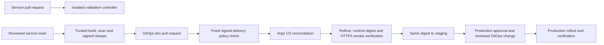

# Application and delivery architecture

The application stays deliberately small so the work centers on delivery and operations. A browser reaches the Node.js frontend, which calls the Go catalogue, Python cart and Java orders services. Redis holds carts; PostgreSQL stores orders. There is no payment provider, account system, stock reservation or external email dependency.

Frontend sessions use a random 256-bit identifier with an HMAC signature. Cookies are HttpOnly and SameSite=Strict; HTTPS environments enable Secure. Mutation requests require the configured browser Origin. The frontend derives ownership from its signed cookie rather than forwarding caller-supplied session headers. Backend services remain internal, with namespace network policies. This baseline does not implement a service mesh or cryptographic service identity.

Orders recomputes prices, rejects empty or invalid carts, and transactionally stores an immutable line-item snapshot with integer minor-unit totals. PostgreSQL advisory locks and a unique session/idempotency-key constraint serialize concurrent retries across replicas. Reusing a key returns the original order. Checkout retains the cart; creating another order requires another key. Anonymous sessions have no account recovery, and rotating the signing secret invalidates existing cookies.

## Repository boundaries

Each row is an independent Git repository, even when checked out beside the others in one workspace.

| Repository | Responsibility |
|---|---|
| `boutique-frontend` | Node.js storefront and browser session boundary |
| `boutique-catalogue` | Go product catalogue |
| `boutique-cart` | FastAPI cart service and Redis client |
| `boutique-orders` | Spring Boot orders, PostgreSQL and Flyway migrations |
| `boutique-ci` | Shared Jenkins library, controller configuration, seeds and delivery jobs |
| `boutique-infrastructure` | AWS Terraform, state bootstrap and managed-data initialization |
| `boutique-gitops` | Argo CD Applications, environment overlays, release policy and monitoring manifests |
| `boutique-platform` | Local runtime, two-cluster lab automation, smoke tests, incident adapter and runbooks |

## Delivery path

The service repository uses one shared pipeline definition. On the validation controller it tests and scans without publishing. On the release controller only protected `main` builds publish the tested image and sign its release record, including scan/SBOM hashes. Subsequent promotions select that immutable digest; they do not rebuild an environment-specific image.

A fixed GitOps policy job loads protected tools and treats PR files as data. Staging requires recent signed verification of the same digest in dev; production requires staging evidence and a named approver. The verifier binds native Deployment/Pod measurements, Argo's actual synchronized revision and real HTTPS smoke results. Promotion and rollback share an environment lock through verification. See [Jenkins setup](jenkins-setup.md) and [release evidence](../../boutique-gitops/docs/release-evidence.md) for the trust assumptions.

## Environment separation

| Path | Dev and staging | Production |
|---|---|---|
| Portable production lab | Separate namespaces on the nonproduction kind cluster | Separate kind cluster |
| AWS reference | Nonproduction EKS/VPC with separate environment data and secrets | Separate EKS/VPC and production data/secrets |
| Fast Compose development | One local application stack | Not a production environment |

The two-cluster lab runs on a suitable laptop Docker host or Linux VM. It uses Calico policy enforcement, TLS ingress, separate credentials and PVCs, and verified PostgreSQL/Redis TLS. Each kind cluster has a single control plane; local databases remain single replica. Multiple workers and application replicas support rollout and disruption exercises, but do not establish control-plane or database HA. The AWS reference adds managed EKS/data services and production availability settings; it has not been applied in this workspace. See [production lab](production-lab.md).

## Operations path

Prometheus collects per-pod application and incident-worker metrics; Grafana provisions dashboards; Alloy ships logs to Loki. Alertmanager routes Slack notifications and critical production incidents to the ServiceNow adapter. Local exercises use internal mock receivers. Production adapter replicas share a dedicated PostgreSQL queue with leasing, retries, revision-safe acknowledgements and dead letters. The local SQLite profile remains single-worker. The queue database is separate from orders, and its availability depends on the deployed data tier.

AWS secret delivery uses Secrets Manager/KMS and scoped External Secrets identities. Lab credentials, CA keys, verifier kubeconfigs and Jenkins signing keys live in ignored private state, with explicit operator provisioning. Do not treat these files or a successful schema check as proof of a deployed platform.

## Internal APIs

| Service | API |
|---|---|
| Catalogue | `GET /products`; `GET /products/{id}` |
| Cart | `GET /carts/{session}`; `PUT`/`DELETE /carts/{session}/items/{product}` |
| Orders | `POST /orders`; `GET /orders/{id}` |

Orders requires `X-Session-ID`; creation also requires `Idempotency-Key`. The frontend maps these to `/api/products`, `/api/cart`, `/api/cart/items/{product}`, `/api/orders` and `/api/orders/{id}`. Smoke tests create synthetic orders: run them only against the project's test data.
