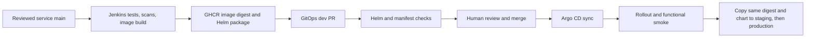

# Deploy through Jenkins and Argo CD on an existing Debian/kind laptop

This is the main deployment path. Jenkins builds and publishes; GitOps pull
requests record desired deployment versions; Argo CD renders Helm and deploys
merged changes. You do not need a manual Kubernetes installation of the app
before CI/CD. Cluster controllers and application secrets are prerequisites.

The laptop profile targets your existing `kind-mega-local` context. It does not
create or replace a cluster, Jenkins home, ingress controller or Argo CD.
The existing 7.5 GiB laptop is suitable for dev-first operation, with one build
at a time. It does not reproduce production availability or isolation.
AWS and the optional two-cluster exercise are separate deployment paths.

## 1. Understand the flow before running commands



Jenkins does not merge deployment PRs or need Kubernetes write access to publish
an application release. A green publishing build does not prove deployment.
Argo health plus a successful functional smoke test establish that separately.

## 2. Check your existing foundation

All commands below run on your Debian laptop, not a cloud runner. Work from
`~/devops-boutique`, containing the eight sibling checkouts.

```bash
cd ~/devops-boutique
kubectl --context kind-mega-local get nodes
kubectl --context kind-mega-local get pods -A
kubectl --context kind-mega-local get storageclass
kubectl config use-context kind-mega-local
```

Use a Ready cluster with Argo CD already installed. The local data manifests
use the default storage class, so confirm one exists.
Do not delete `mega-local` or reinstall Argo/cert-manager/ingress on this path.
Default kindnet does not enforce NetworkPolicy. Policies remain in the charts,
but production isolation requires a capable CNI and connectivity tests.

Update clean checkouts without discarding local work:

```bash
cd ~/devops-boutique/boutique-ci
git status --short
git pull --ff-only
cd ~/devops-boutique/boutique-gitops
git status --short
git pull --ff-only
cd ~/devops-boutique/boutique-platform
git status --short
git pull --ff-only
```

If a status command shows local changes, preserve/review them before pulling.

## 3. Reuse the connected Jenkins agent

Your existing Jenkins controller listens on port 8080. Keep its home volume.
Its built-in executors must be zero. The connected inbound agent is
`boutique-build-agent`, with one executor and label `trusted-release`.
Its workspace is `/home/boutique-builder/jenkins-agent`; it uses the rootless
Docker daemon belonging to UID 1001. Do not replace the controller or rebuild
the unchanged agent image just to update pipeline code.

```bash
docker logs --tail 30 boutique-build-agent
docker exec boutique-build-agent docker info \
  --format 'Security: {{json .SecurityOptions}}'
```

Expect a connected Jenkins node and `name=rootless`. A socket mount gives full
control of that daemon, even when marked read-only. Never use the laptop's
rootful Docker socket for builds. The controller's preexisting socket mount
is unnecessary; remove it during a planned recreation preserving the existing
home volume and configuration. This guide does not stop your existing controller.

For a fresh installation rather than your existing controller, see
[jenkins-setup.md](jenkins-setup.md). The checked-in Compose configuration now
starts one controller, retaining the former `release-home` volume name.
It is not a migration command for your manually created `jenkins` container.

## 4. Configure the shared library and credentials

Under **Manage Jenkins → System → Global Untrusted Pipeline Libraries**, add:

| Setting | Value |
| --- | --- |
| Name | `boutique-ci` |
| Default version | Full reviewed CI commit from `git rev-parse HEAD` |
| Load implicitly | Off |
| Allow version override | Off |
| Retrieval method | Modern SCM / Git |
| Repository | `https://github.com/subhankar12-spec/boutique-ci.git` |
| Credentials | `github-read`, or none for the public library |

Under Global properties, keep `BOUTIQUE_CONTROLLER_ROLE=release`.
This is a project routing guardrail, not an isolation boundary.

Required publishing credentials:

| ID | Jenkins kind | Purpose |
| --- | --- | --- |
| `github-read` | Username/password | Read source repositories; fine-grained Contents read and Metadata read |
| `ghcr-publish` | Username/password | GHCR publication; supported classic token with package write/read scopes |
| `gitops-pr` | Username/password | GitOps branch/PR writes; only GitOps repository access |

For GitOps PRs, a fine-grained token needs Contents and Pull requests read/write.
A production workflow needs a distinct bot/App identity so a human can approve:
GitHub does not count self-approval. The current username/password binding
supports PAT credentials; a GitHub App requires compatible credential handling
and short-lived token refresh before adoption. Do not assume an App ID is a PAT.
A machine-user collaborator can use a supported classic token scoped for the
public repository; limit that account's repository access. Never grant bypass.

The previous four signing-key credentials are no longer consumed. Remove only
those keys after updating the pinned library/jobs and confirming old builds have
finished. Keep gitops-checks as Secret text for standard manifest statuses, with
GitOps Contents/PR read and Commit statuses write. Never print tokens or upload
keys to Git.

## 5. Create or update the Pipeline seed

Disable an old Freestyle seed. Create **New Item → Pipeline**, named
`boutique-seed-release-pipeline`.

| Pipeline setting | Value |
| --- | --- |
| Definition | Pipeline script from SCM |
| SCM | Git |
| Repository | `https://github.com/subhankar12-spec/boutique-ci.git` |
| Credentials | `github-read` |
| Branch specifier | Full reviewed CI commit containing the simplified pipeline |
| Script Path | `pipelines/seed-release.Jenkinsfile` |

Save and run it. `SUPPRESS_AUTOMATIC_BUILDS=true` is the default: indexing can
create branches without triggering application builds. Manual builds work.
The seed creates four service jobs plus promote, rollback, manifest validation,
verify and infrastructure jobs. Keep `ENABLE_INCIDENT_BRIDGE_BUILD=false`
(default); enabling it adds the optional platform adapter build. Infrastructure
is manual and optional.

The Job DSL uses Jenkins configuration APIs. If Jenkins requests script approval,
review the exact checked-in seed/DSL and only the necessary signatures under
In-process Script Approval. Do not disable the sandbox globally. The seed
preserves jobs it no longer manages. Disable old `boutique-bootstrap` and
`boutique-gitops-check` jobs manually after reviewing active builds; they are
not deleted automatically, and old job configurations are not safe to run.

The ServiceNow adapter build is opt-in in the seed with
`ENABLE_INCIDENT_BRIDGE_BUILD=true`. If an earlier seed already created
`boutique-platform`, disable that Jenkins job when the integration is unused;
removedJobAction=IGNORE deliberately preserves existing jobs.

## 6. Build and publish the four services

Open each Multibranch project and use **Scan Multibranch Pipeline Now** if needed:
`boutique-frontend`, `boutique-catalogue`, `boutique-cart`, `boutique-orders`.
Only `main` is discovered; origin/fork PR builds are not enabled on this
credentialed controller. Configure isolated workers before adding untrusted PRs.

Run each `main` job, one at a time. The service workflow performs:

1. Checkout and protected-main source check.
2. Secret scan.
3. Helm lint/schema validation and chart packaging.
4. Docker build, including the tests in each service's multi-stage Dockerfile.
5. Runtime image scan and SBOM generation.
6. Publish the tested image and versioned chart to GHCR.
7. Archive the image digest, source commit, scans, SBOM and chart package.
8. When `DELIVER_TO_DEV=true`, invoke promotion to open a dev GitOps PR.

The commit tag/chart version is not overwritten. A repeated source commit fails
publication rather than silently replacing an existing release. Reuse the
recorded build for deployment; new code gets a new commit and artifact version.

`DELIVER_TO_DEV` defaults to true. Initial dev PRs can be opened one service at
a time; do not connect/sync the application until all four selections are real.
If you deliberately build with it false, run `boutique-promote` manually with:

| Parameter | Value |
| --- | --- |
| TARGET | `dev` |
| SERVICE | The built service |
| IMAGE | Exact `image-digest.txt` value from that publishing build |
| RELEASE_BUILD | That service/main build number |

The promotion retrieves the archived package from the fixed service job; it
rejects a digest mismatch and an incorrect chart name/version. The parent
publishing stage releases its executor before invoking promotion, so a
single-executor agent can run both jobs without a nested-job deadlock.

## 7. Validate and merge the initial dev selections

Each PR contains an image digest, an exact packaged service chart and the
corresponding chart dependency version. The ordinary Jenkins job
`boutique-gitops-validate` checks Helm/manifests and reports
**boutique/gitops-validation** on the PR commit. It uses the existing agent;
promotion queues it without waiting, so one executor does not deadlock.
The scripts come from protected main; candidate files are configuration inputs,
not executed shell scripts or Jenkinsfiles. The API token is not bound while
rendering. No arbitrary application PR build is enabled by this check.

Keep `gitops-checks` as a **Secret text** credential: the GitOps-scoped token
requires Contents/PR read and Commit statuses read/write. It is not a signing
key or another build agent. For manual PRs or updated PR heads, run the checker
with `PR_NUMBER` again; an old commit's green check does not authorize a new head.

Configure main protection/rulesets: require PRs, the
**boutique/gitops-validation** status, current-base checks, independent review/
CODEOWNER review where supported, stale-review dismissal, and prohibit force
pushes/protection bypass. Run the checker once before choosing its status as
required. Protect CI definitions and service main too. GitHub plan/repository
settings determine available protection options.

If your existing rule requires `boutique/gitops-policy`, replace that requirement
with **boutique/gitops-validation** before merging; the old status is no longer produced.
No automatic merge or production approval in a second custom Jenkins system:
the protected GitOps PR is the approval boundary.

Review, validate and merge all four dev PRs. Update your local GitOps checkout:

```bash
cd ~/devops-boutique/boutique-gitops
git pull --ff-only
python3 - <<'PY'
import sys
sys.path.insert(0, 'scripts')
from release_config import ROOT, SERVICES, selected_image, validate_identity
for service in SERVICES:
    image = selected_image(ROOT, service, 'dev')
    validate_identity(service, 'dev', image)
    print(service, image)
PY
```

Every service must use `@sha256:...`; bootstrap placeholders are intentionally
non-deployable. Make published application images public in GHCR settings for
the laptop path. If private, provision a namespace-scoped imagePullSecret and
chart pull configuration; do not place registry tokens in Helm values.

## 8. Prepare dev data and connect Argo CD

The laptop profile keeps GHCR digests while enabling local PostgreSQL/Redis.
It does not use the local-image overrides in `homelab/dev`.
Secrets are generated directly in the chosen cluster and preserved on reruns.

```bash
kubectl config use-context kind-mega-local
cd ~/devops-boutique/boutique-platform
python3 scripts/k8s-secrets.py dev
cd ~/devops-boutique/boutique-gitops
python3 scripts/render.py dev --profile laptop --lint
python3 scripts/render.py dev --profile laptop > /tmp/boutique-dev-review.yaml
kubectl --context kind-mega-local apply -f applications/dev-laptop.yaml
```

Inspect the rendered file before applying the Application. It contains four
services, namespace policy, quotas and the two data StatefulSets, but no plaintext
credentials. It uses existing default persistent storage and secrets.

In Argo CD, open **boutique-dev**, inspect **Diff**, then **Sync**. Initial sync
is manual in this profile. PostgreSQL/Redis must initialize and orders Flyway
migrations must complete before frontend readiness succeeds. Check:

```bash
kubectl --context kind-mega-local -n boutique-dev get pods,pvc
kubectl --context kind-mega-local -n boutique-dev rollout status deployment/frontend --timeout=180s
kubectl --context kind-mega-local -n boutique-dev rollout status deployment/catalogue --timeout=180s
kubectl --context kind-mega-local -n boutique-dev rollout status deployment/cart --timeout=180s
kubectl --context kind-mega-local -n boutique-dev rollout status deployment/orders --timeout=180s
```

The initial rollout may take longer than 180 seconds while pulling Java/images;
inspect Events/logs before retrying. Do not repeatedly delete data pods or PVCs.
After the complete first rollout, enable **Auto-Sync / Self-Heal / Prune** in the
Application through a reviewed configuration change if desired. The initial
manual policy is deliberate; Jenkins still only proposes PRs.

## 9. Open and functionally test the application

Jenkins already owns host port 8080, so use 8088 for the app. In one terminal:

```bash
kubectl --context kind-mega-local -n boutique-dev port-forward \
  --address 127.0.0.1 service/frontend 8088:8080
```

Keep it running; open `http://localhost:8088`. In another terminal:

```bash
cd ~/devops-boutique/boutique-platform
BASE_URL=http://localhost:8088 python3 tests/smoke/smoke.py \
  --environment dev --report /tmp/boutique-dev-smoke.json
```

The profile configures that exact browser Origin and non-Secure cookies only
for loopback dev. Cloud and TLS lab profiles retain HTTPS/Secure cookies.
The smoke test checks cart/session separation, pricing, checkout, ownership and
idempotency, and creates test orders. Pods merely being Running is insufficient.

`boutique-verify` optionally automates these checks when scoped read-only
`kubeconfig-dev` and `BOUTIQUE_DEV_ORIGIN=http://localhost:8088` are configured.
Its agent must reach the API and the port-forward, as your host-networked
agent can. For TLS environments, also configure `boutique-ca-ENV` and the
trusted HTTPS origin. Do not upload cluster-admin kubeconfigs. Read-only
verification needs deployments/pods reads and the named Argo Application read;
use the verifier RBAC generated by `boutique-platform/scripts/production-lab.py` as a reference.
Verifier reports are archived ordinary operational reports, not signed evidence.

## 10. Routine release and promotion

After a reviewed service change merges into main, run its build. Review/merge
the new dev PR, sync Argo if automatic sync is not enabled, and run smoke tests.
Once bootstrap is complete, rerun the seed with
`SUPPRESS_AUTOMATIC_BUILDS=false` to permit automatic main builds during
indexing/events. Local Jenkins is not reachable by GitHub webhooks: use manual
scans or scheduled discovery until a protected HTTPS webhook endpoint exists.

For staging, run `boutique-promote` with TARGET=staging and SERVICE selected;
leave IMAGE and RELEASE_BUILD empty. It copies the digest/chart currently
selected in dev. Confirm dev is actually running that selection and passed
smoke tests before reviewing the staging PR. For production, the same process
copies staging. The PR checks validate configuration, not live test success;
the reviewer must check rollout/smoke reports. No rebuild occurs.

Do not sync a new environment until all four services have valid selections
and its data, secrets, ingress/TLS and Argo Application are configured. On AWS,
use `applications/ENV.yaml` plus the environment infrastructure/ESO/ingress
prerequisites. The optional two-cluster lab uses its lab Applications/profiles.
Do not apply AWS reference Applications to the laptop and expect managed data.

Dev/staging may share a nonproduction cluster with distinct namespaces/data;
production should use a separate cluster and preferably AWS account. The laptop
dev profile is not offered for production and is not an availability claim.

## 11. Roll back and recover

Find a previous protected-main GitOps commit that was known to work. Run
`boutique-rollback` with SERVICE, TARGET and its full GITOPS_COMMIT. The job
restores that service's exact prior digest and chart package from Git history,
validates them and opens a PR. Review migration compatibility before merging.
It does not reset main, force-push, revert unrelated services or restore data.

Merge, sync, inspect rollouts and run smoke checks. For database loss/corruption,
follow [the DR runbook](runbooks/disaster-recovery.md). App rollback is not a
database rollback. Keep off-host backups, run restore drills and measure
[SLOs](slo.md) and [RTO/RPO](recovery-targets.md); documented targets are not proof.

## 12. Add monitoring once dev works

Keep Prometheus, provisioned Grafana dashboards, Alertmanager, Loki and Alloy.
The default chart now routes alerts to Slack only, with no incident adapter or
queue database. Supply `monitoring-integrations` containing `slack_webhook`
securely, and the Grafana admin secret before syncing monitoring. See
[monitoring.md](monitoring.md) for names, resource budgets and activation.

ServiceNow is opt-in with `incidentBridge.enabled=true`, a tested adapter digest,
its integration credentials and (production profile) a dedicated queue. It is
not needed to build or deploy the app. The full stack may compete with builds
on 8 GiB; add it after the app passes smoke tests and observe actual usage.

## 13. What this guide does not silently do

It does not create paid AWS resources, replace your Jenkins home, delete your
existing cluster, populate tokens, send Slack/ServiceNow notifications or claim
full production readiness. It provides the deployment sequence and code paths;
actual GHCR publication, Argo rollout, notifications and restore exercises need
your host/account and must be verified. See [validation.md](validation.md).
