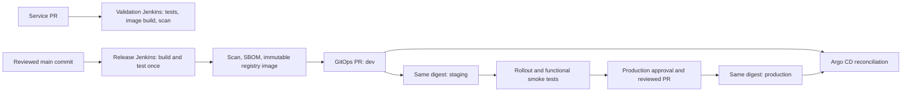

# Shipyard Boutique — Jenkins DevOps lab

A working four-service ecommerce app, with separate repository boundaries, Jenkins pipelines, Kubernetes GitOps, and an AWS reference architecture. Application scope stays small so the learning focus is delivery and operations.

## Eight repository boundaries

| Directory | Responsibility |
|---|---|
| boutique-frontend | Node.js storefront and session-aware API gateway |
| boutique-catalogue | Go product API; static catalogue |
| boutique-cart | Python/FastAPI cart backed by Redis |
| boutique-orders | Java/Spring Boot orders backed by PostgreSQL |
| boutique-ci | Jenkins shared library, pipeline definitions, controller config and agents |
| boutique-infrastructure | Terraform AWS reference infrastructure and database bootstrap |
| boutique-gitops | Kubernetes bases/overlays, Argo CD, network policies and monitoring |
| boutique-platform | Docker Compose, homelab setup, smoke tests and runbooks |

Each directory can be pushed to its own GitHub repository. No remote repositories or cloud resources were created. `subhankar12-spec` is the configurable default GitHub owner. Do not publish generated secrets, provider caches, database backups or build outputs.

## Run the application

Prerequisites: Docker Engine with Compose v2, Python 3, roughly 4 GB RAM for the app, internet access for dependency/image downloads. From this workspace:

```bash
cd boutique-platform
./scripts/local-up.sh
```

The storefront listens on local port 8080. Only the frontend is exposed. Local secrets are generated once in ignored `local/.env`; reruns preserve them. Do not delete database volumes casually: existing database passwords must match retained secrets.

```bash
python3 tests/smoke/smoke.py
cd local
docker compose down  # preserves database volumes
```

The cloud runner needs special proxy-aware artifact preparation; see `boutique-platform/docs/cloud-runner.md`. Standard Docker builds are intended for a normal Docker host with working outbound DNS/TLS.

## Delivery model



Validation and release controllers are separate trust boundaries. Release credentials never exist on the PR controller. Jenkins does not apply application manifests; Argo CD owns them. Production changes require Jenkins approval and reviewed GitOps PRs. The production approver must inspect the recorded staging verification evidence; this first implementation does not cryptographically enforce that evidence link.

## Two deployment tracks

- **Homelab:** Compose, then kind/local Kubernetes. All three environments can use separate namespaces and data on one local cluster. This demonstrates promotion but does not provide production infrastructure isolation or high availability.
- **AWS reference:** separate nonprod/production VPCs and EKS clusters; private API endpoints; private workers; per-environment RDS, Redis, secrets and IAM bindings; production Multi-AZ data services; encrypted state, backups, budget alerts and an SSM-only operator host. Intentionally not the cheapest deployment.

## What is verified

See `boutique-platform/docs/validation.md` for exact checks and limitations. A file existing is not evidence that AWS, Jenkins jobs, or Kubernetes deployment ran. Required bootstrap substitutions are explicit and intentionally block deployment until supplied.

## Read next

1. `boutique-platform/docs/architecture.md`
2. `boutique-ci/README.md` and `boutique-platform/docs/jenkins-setup.md`
3. `boutique-gitops/README.md`
4. `boutique-infrastructure/README.md`
5. `boutique-platform/docs/runbooks/`

Observability includes Grafana dashboards, per-pod Prometheus discovery, Alertmanager Slack/ServiceNow routing, a durable incident adapter, Loki/Alloy collection and local mock drills. See boutique-platform/docs/monitoring.md for activation and limitations. The default stack is affordable and single replica; production HA is a separate undeployed reference.
